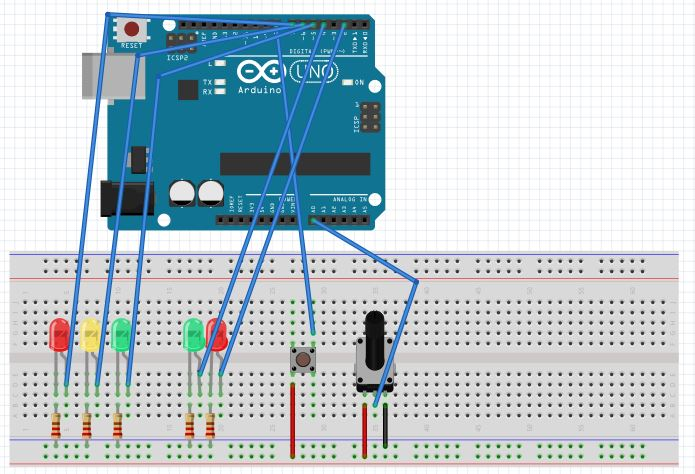
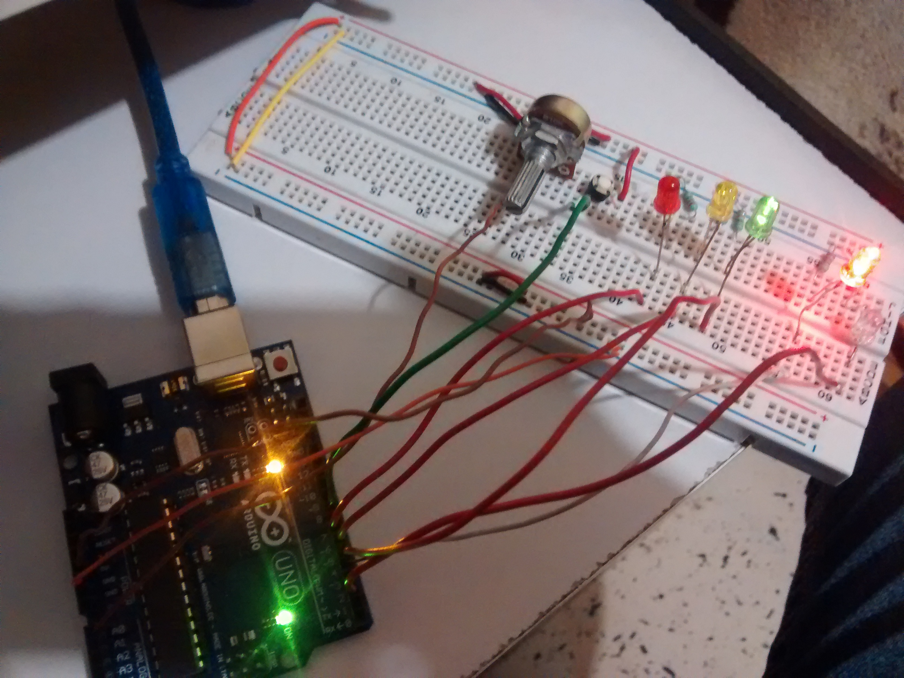
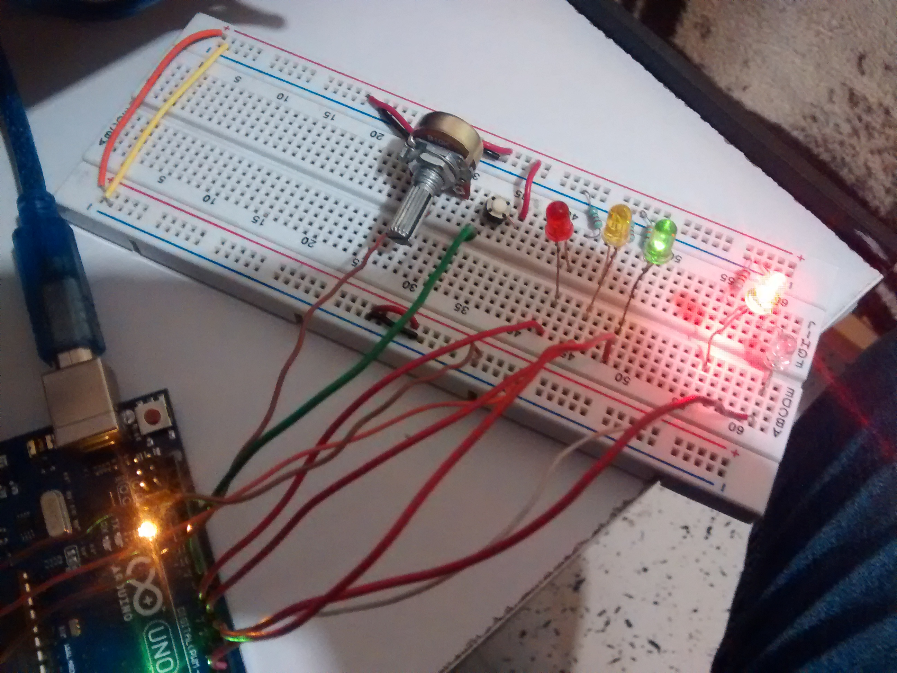
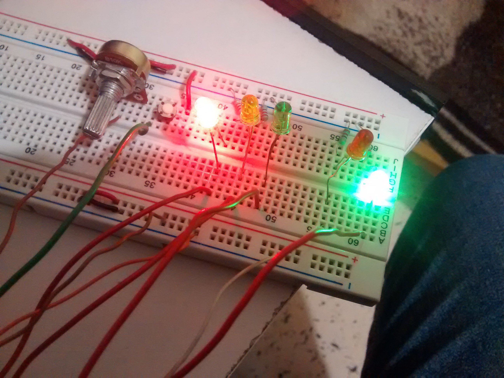
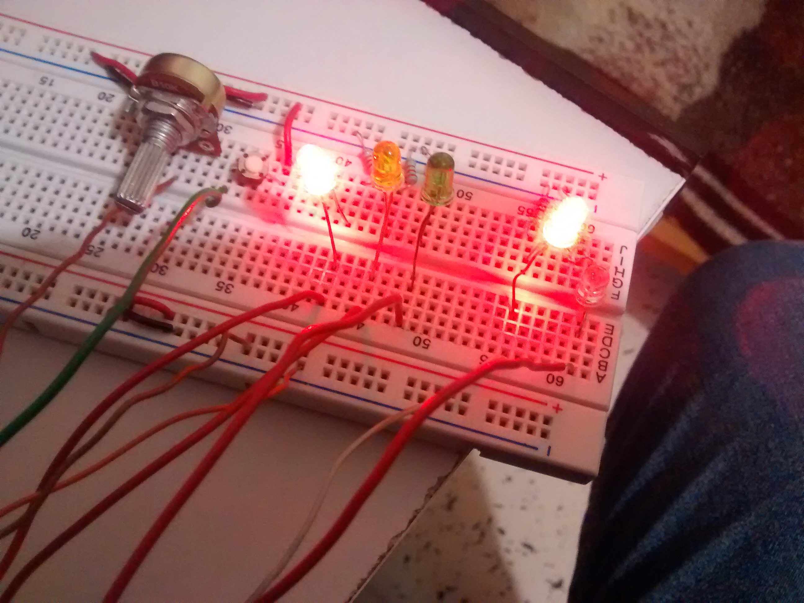
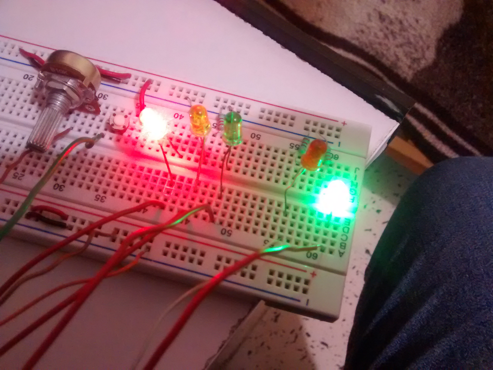
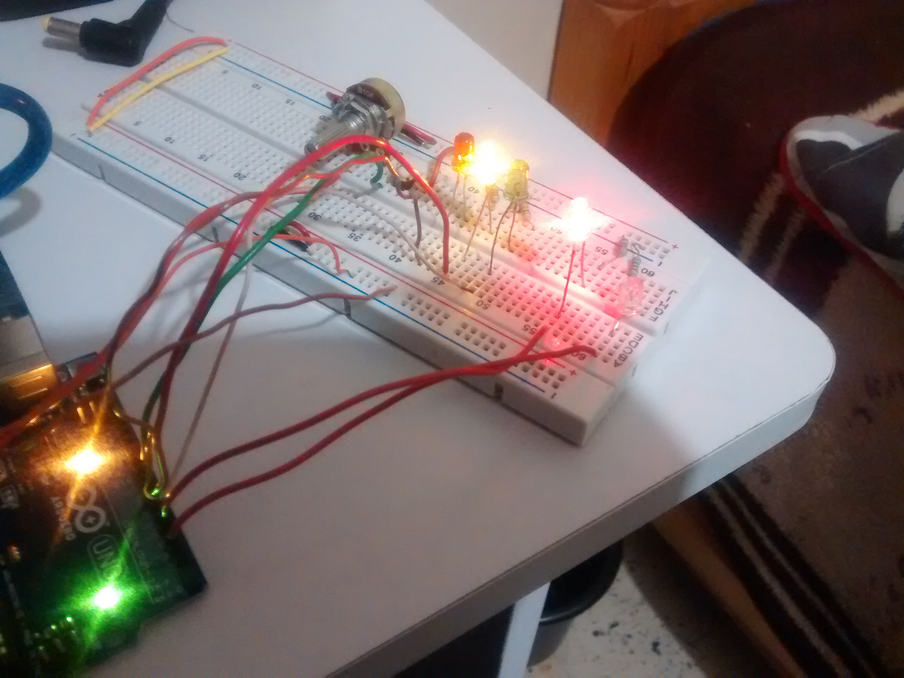

# Semaforo con Potenciometro y pushbutton

### Presenta: Francisco Javier Padilla Aguirre
### Estudiante de Ingeniería en Sistemas Computacionales del Instituto Tecnológico de León
### Materia: Sistemas Programables
***
## Índice
+ [Introducción](#introducción)
+ [Objetivo](#objetivo)
+ [Materiales](#materiales)
+ [Descripción](#descripción)
+ [Diagrama](#diagrama)
+ [Evidencias](#evidencias)
+ [Código](#código)
+ [Conclusiones](#conclusiones)
***
## Introducción
>En el presente reporte se podrá apreciar cómo fue desarrollada la práctica de simular el funcionamiento de dos semáforos uno 
>simulando que es para autos y el otro semáforo para peatones, harán sus cambios de acuerdo para avance de autos y peatón 
>detenido y viceversa.
>Todo eso hecho con programación en arduino, se incluye un cambio a petición del peatón presionando un botón para que haga su 
>cambio de su semáforo a ver y el de autos a rojo. Un potenciómetro que hará que varié la velocidad de los cambios.
>Arduino es una herramienta práctica que nos permite realizar desde practicas muy sencillas como practicas muy complejas, 
>es una buena herramienta en la electrónica para propiciar el aprendizaje combinado de la programación y la electrónica.
***
## Objetivo
> Objetivo general
> Armar y programar una simulación de un semáforo americano mediante uso de arduino y componentes de electrónica.

> Objetivos específicos.

> •Sincronizar mediante programación en arduino los cambios de los semáforos.

> •Controlar la velocidad de los cambios de los semáforos mediante potenciómetro.

> •Implementar el uso de un push button para que cuando sea presionado haga el cambio a rojo el 
>semáforo para autos y en verde el de los peatones.

***
## Materiales
> •5 LED’s (2 rojos, 1 amarillo, 2 verdes).

> •5 resistencias de 220 ohms.

> •1 push button.

> •1 potenciómetro de 10k.

> •Cable calibre 22.

> •Arduino uno.

> •PC con software de programación para arduino.

> •Cable USB.

***
## Descripción
>El código es muy sencillo de entender, así que solo será limitado a explicar algunas cosas, ya que otras sin obvias

>pv es led verde para peatones
>pr es led rojo para peatones
>sv es led ver para semáforo
>sa es led amarillo para semáforo
>sr es led rojo para semáforo

>Estos a su vez van respectivamente a las siguientes entradas digitales del arduino:
>2, 4, 5, 6, 7.

>La entrada del potenciómetro será en la entrada analógica A0.

>valorPot es la variable para el valor del potenciómetro.

>parpadeo será usado como variable para la función del map, y a su vez para el tiempo del delay.

>Boton=8 es la variable del push button conectado a la entrada 8 digital.

>En el setUp 
>se deja todas esa variables como salida para que ya que reciben una señal que permite realizar alguna acción por esa razón el OUTPUT.

>el Serial.begin(9600) es código que permite iniciar la comunicación serial con el potenciómetro y la máquina.

>En las primeras líneas del loop se le el valor del potenciómetro y se almacena en la variablePot.

>parpadeo lo que hace con la función map es tomar el valor del potenciómetro y como si fue un if anidado establece un rango que podrá tomar esa variable con respecto al movimiento del potenciómetro.

>el siguiente es un if que lee la entrada del botón si este manda la señal en alto de inmediato entrara al método cambioLuz().

>Lo que hace el método cambioLuz() es sencillo mediante las variables asignadas en un inicio mandaran las salidas a cada led como se aprecia en Alto y Bajo; o sea, HIGH y LOW, con sus respectivos delay y el valor que tomo la variable parpadeo del potenciómetro.
>Así de esta manera se hace toda la secuencia de cambios tanto para el semáforo peatonal como el semáforo para autos.

>Una vez terminado el método se regresa al loop donde esperara que se presione el botón para activar otra vez la secuencia de cambioLuz().

***
## Diagrama

***
## Evidencias

***
## Código
~~~
int pv=2, pr=4, sv=5, sa=6, sr=7; 
//pv es led verde para peatones
//pr es led rojo para peatones
//sv es led ver para semaforo
//sa es led amarillo para semaforo
//sr es led rojo para semaforo
/*El presente programa presenta la simulación de un crucer de autos y peatones 
 * con semaforos, el sistema de los semaforos es un sistema americano, ya que contiene un
 * boton que permite hacer el cambio a verde el semaforo de los peatones siempre que estos desen
 */
int pinPot = A0;  // pin en donde se usará el potenciómetro
int valorPot;  // Variable para el valor del potenciómetro
int parpadeo;  // Función del map
int Boton=8;  // variable del pushbutton

void setup() {
   //peaton
  pinMode(pv, OUTPUT);
  pinMode(pr, OUTPUT);
  //semaforo
  pinMode(sv, OUTPUT);
  pinMode(sa, OUTPUT);
  pinMode(sr, OUTPUT);
  pinMode(Boton, OUTPUT);
  Serial.begin(9600);
  digitalWrite(sv,HIGH);
  digitalWrite(pr,HIGH);
  

}

void loop() {
  valorPot = analogRead(pinPot); // Lee el valor del pot y lo guarda en la variable valorPot
  parpadeo = map(valorPot, 0, 1023, 100, 500);  // función de mapeo que definirá el delay entre 4 rangos.
  if(digitalRead(Boton)) // el if pretende que una vez presionado el boton este hara la rutina 
  //del cambio de luz
  
  cambioLuz();
    //estado = LOW;
  
}

void cambioLuz(){
  digitalWrite(sv, HIGH);
  digitalWrite(pr, HIGH);
  delay(parpadeo);
  //parpadeo semaforo
  digitalWrite(sv, LOW);
  delay(parpadeo);
  digitalWrite(sv, HIGH);
  delay(parpadeo);
  digitalWrite(sv, LOW);
  delay(parpadeo);
  digitalWrite(sv, HIGH);
  delay(parpadeo);
  digitalWrite(sv, LOW);
  delay(parpadeo);
  digitalWrite(sv, HIGH);
  delay(parpadeo);
  //cambio semaforo
  digitalWrite(sv, LOW);
  digitalWrite(sa, HIGH);
  delay(parpadeo);
  delay(parpadeo);
  digitalWrite(sa, LOW);
  digitalWrite(pr, LOW);
  //cambio peaton y semaforo rojo
  digitalWrite(pv, HIGH);
  digitalWrite(sr, HIGH);
  delay(parpadeo);
  delay(parpadeo);
  delay(parpadeo);
  delay(parpadeo);
  delay(parpadeo);
  //parpadeo peatonal
  digitalWrite(pv, LOW);
  delay(parpadeo);
  digitalWrite(pv, HIGH);
  delay(parpadeo);
  digitalWrite(pv, LOW);
  delay(parpadeo);
  digitalWrite(pv, HIGH);
  delay(parpadeo);
  digitalWrite(pv, LOW);
  delay(parpadeo);
  digitalWrite(pv, HIGH);
  delay(parpadeo);
  digitalWrite(pv, LOW);
  delay(parpadeo);
  digitalWrite(pv, HIGH);
  delay(parpadeo);
  //cambio semaforo y peatonal
  //cambio semaforo
  digitalWrite(pv, LOW);
  digitalWrite(pr, HIGH);
  delay(parpadeo);
  digitalWrite(sr, LOW);
  digitalWrite(sv, HIGH);

//  cambioTiempo = millis();
}
~~~

***
## Conclusiones
>El desarrollo de la práctica fue algo que no genera muchos problemas al momento de desarrollarla, solo tener cuidado con la 
>programación ya que puede que haga el funcionamiento no es el que esperas, también que el uso de elementos no tan complejos 
>genera mejores resultados, dado que dentro de lo complejo pueda surgir un error y no sea tan sencillo reconocerlo.
>Es un practica en la cual se implementó en conjunto varias practicas pequeñas desarrolladas anteriormente; tales como, 
>encender un LED, leer los valores de un potenciómetro, encender apagar o hacer una función con LED’s cuando se presiona 
>un push button, esta práctica fue ideal para aplicar todo lo que se ha venido haciendo.

***

